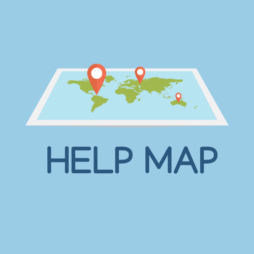

# helptank

Help-Tank developed as a weekend Codeathon project with Emmanuel Stephen and Timothy Lefkowitz

Help-Tanks goal is to simplify help that is around your location. I will continue to try to update this project. I'm at the end of a capstone and barely making it, Updates will come soon :D 

